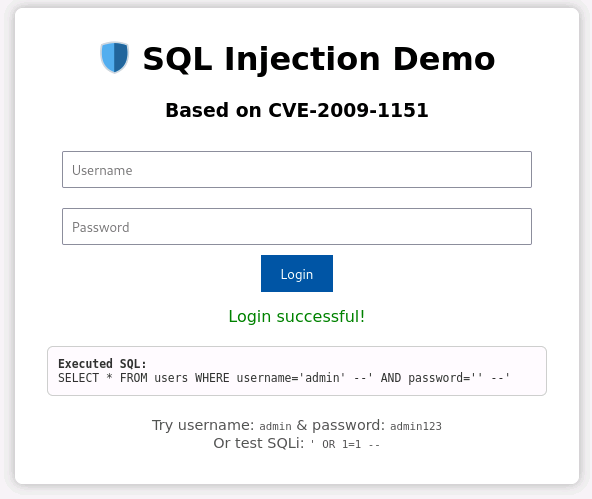
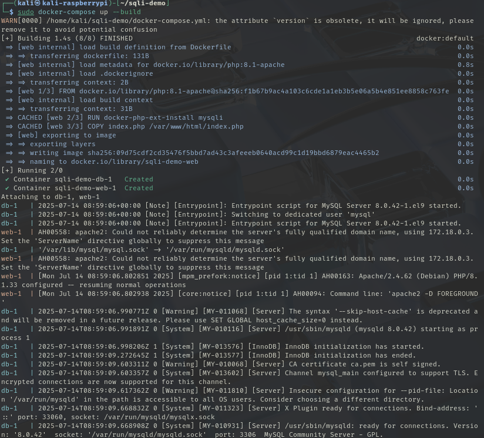
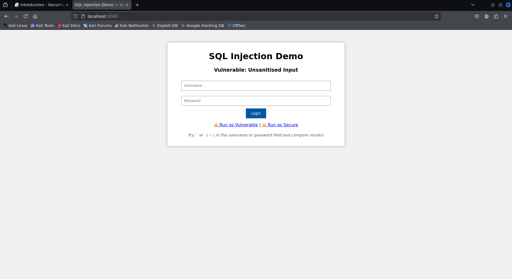
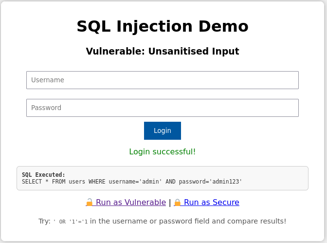
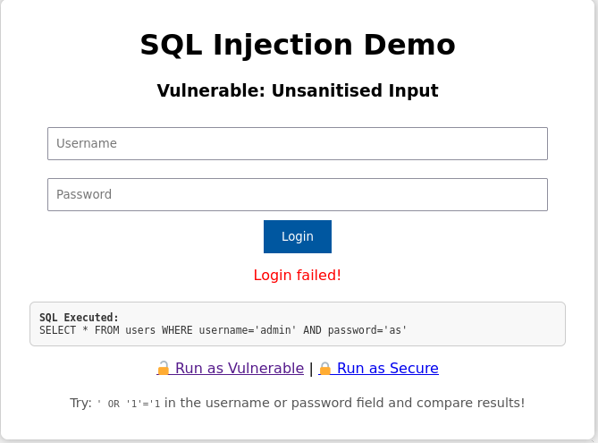
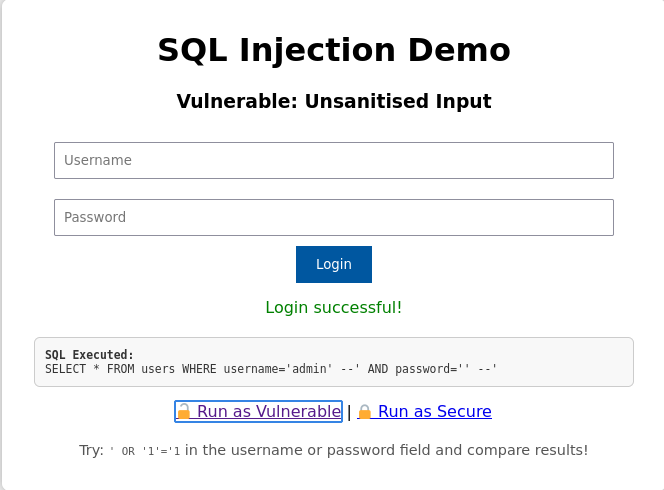
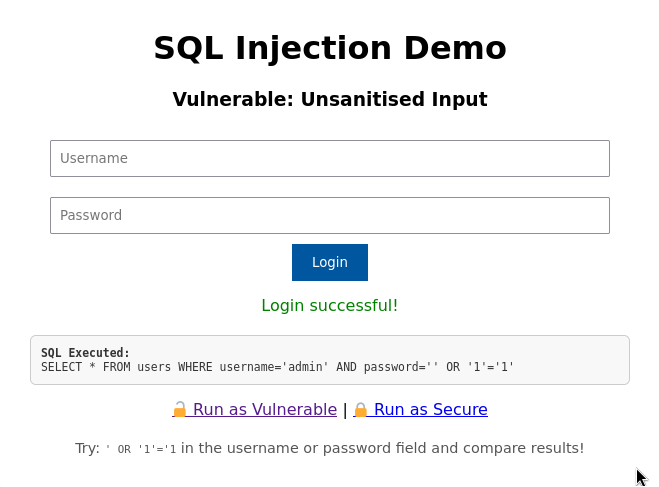
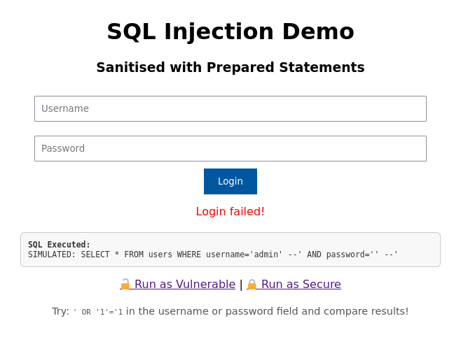
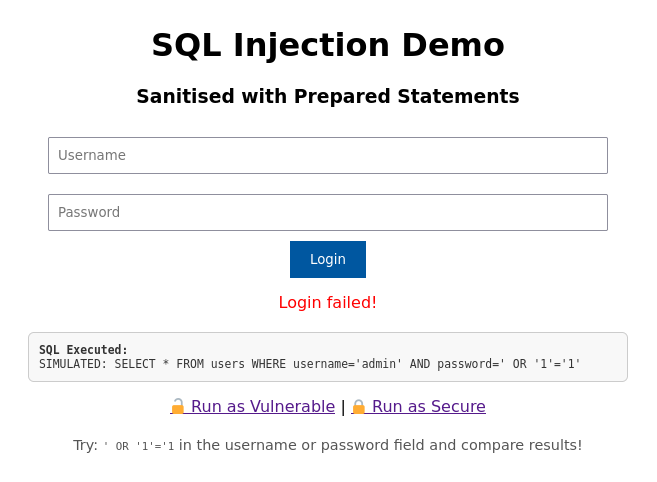

# CVE

~~~admonish info

By the end of this lab you should be able to:

- Identify how improperly handled user input can lead to command and SQL injection vulnerabilities

- Explain the underlying mechanics of CVE-2009-1151 (SQL Injection) and CVE-2014-6271 (Shellshock)

- Exploit both vulnerabilities in a controlled lab environment using crafted inputs

- Compare vulnerable vs. sanitised/secured implementations of user input handling

- Describe mitigation strategies for each vulnerability (e.g., prepared statements, input sanitisation, environment variable handling)

- Reflect on the impact of these vulnerabilities in real-world systems and software supply chains

~~~


## Part 1: SQL-Injection

~~~admonish info

In this section you are going to see how to perform a SQL-Injection (sqli) based on the [CVE-2009-1151](https://cve.circl.lu/cve/CVE-2009-1151). We will be using the Raspberry Pi 5 with the provided Kali image. 

~~~


### Task 1.1 Setup

1.  Create a new folder in the home directory called `sqli-demo`

    ~~~admonish terminal
    
    ```
    $ mkdir sqli-demo
    ```

    ~~~

2. Inside that directory we need to create an `init.sql` to create a database and initialise a table

    ~~~admonish code
    ```sql
    CREATE DATABASE IF NOT EXISTS demo;
    USE demo;
    CREATE TABLE users (id INT, username VARCHAR(100), password VARCHAR(100));
    INSERT INTO users VALUES(1, 'admin', 'admin123');
    ```

    ~~~

    ~~~admonish example title="Explanation!"

    This SQL script sets up the database environment for the injection lab:

    - `CREATE DATABASE IF NOT EXISTS demo;`  
    Ensures a database called `demo` is available. If it already exists, no error is thrown.

    - `USE demo;`  
    Switches the active database context to `demo` so subsequent commands apply to it.

    - `CREATE TABLE users (id INT, username VARCHAR(100), password VARCHAR(100));`  
    Creates a `users` table with three columns: an integer ID, a username (up to 100 characters), and a password (also up to 100 characters).

    - `INSERT INTO users VALUES(1, 'admin', 'admin123');`  
    Inserts a single admin user with a known password. This allows you to test both valid login attempts and SQL injection attacks.

    ~~~

3. Now we can create an isolated environment, you should always do this for security reasons, `Dockerfile`

    ~~~admonish code
    
    ```Dockerfile
    FROM: php:8.1-apache
    RUN: docker-php-ext-install mysqli
    COPY index.php /var/www/html/index.php
    ```

    ~~~

    ~~~admonish example title="Explanation!"

    This `Dockerfile` builds a simple web server environment for the SQL injection lab:

    - `FROM php:8.1-apache`  
    Uses an official Docker image that bundles PHP 8.1 with Apache. This provides a fully functional web server ready to run PHP applications.

    - `RUN docker-php-ext-install mysqli`  
    Installs the `mysqli` extension, which is required for PHP to interact with MySQL databases. Without this, your PHP code wouldn’t be able to use `new mysqli(...)`.

    - `COPY index.php /var/www/html/index.php`  
    Copies our PHP login script (*does not exist yet*) into the default Apache web root directory. This makes it accessible at `http://localhost/index.php`.

    ~~~

4. Of course we do not want to be writing out a really long command to launch our docker image...  so instead we will create a `docker-compose.yml`

    ~~~admonish code

    ```docker
    version: '3'
    services:
    web:
        build: .
        ports:
        - "8080:80"
        volumes:
        - ./index.php:/var/www/html/index.php
        depends_on:
        - db
    db:
        image: arm64v8/mysql:8.0.42
        environment:
        MYSQL_ROOT_PASSWORD: root
        volumes:
          - ./init.sql:/docker-entrypoint-initdb.d/init.sql
    ```

    ~~~

    ~~~admonish example title="Explanation!"

    This `docker-compose.yml` file defines a two-container environment: a web server (`web`) and a MySQL database (`db`).

    - Specifies the Compose file format version. Version 3 is widely supported and suitable for most setups.
    
        ```yml
        version: '3'
        ```


    - Declares the list of containers to be managed.

        ```yml
        services:
            ...
        ```
   
    
    - Builds a custom image from the local `Dockerfile` in the current directory.
       
        ```yaml
        web:
            build: .
        ```
    
    - Maps port `8080` on the host to port `80` in the container (Apache default), so your PHP app is accessible at `http://localhost:8080`.
        
        ```yml
        ports:
          - "8080:80"
        ```

    - Mounts the local `index.php` into the container's web root. This allows you to edit the file on the host and see changes immediately.
        
        ```
        volumes:
         - ./index.php:/var/www/html/index.php
        ```

    - Ensures the database container (`db`) starts before the web service. This helps prevent connection errors during startup.
        
        ```yml
        depends_on:
          - db
        ```
    - Use an ARM64-compatible MySQL 8 image — necessary for running on Raspberry Pi or other ARM-based systems.

        ```yml
        db:
          image: arm64v8/mysql:8.0.42
        ```

    - Sets the root password for the MySQL server to `root`. This is used in your PHP script to connect as the `root` user.

        ```yml
        environment:
        MYSQL_ROOT_PASSWORD: root
        ``` 
    - A special directory inside the MySQL container. When the MySQL container starts for the first time, it automatically executes any `.sql` files found in this directory.

        ```yml
        volumes:
          - ./init.sql:/docker-entrypoint-initdb.d/init.sql
        ```
    ~~~

5. copy the `index.php` from `/opt/gre/sqli-demo/index.php` to the current directory:


    ~~~admonish terminal

    ```sh
    $ cp /opt/gre/sqli-demo/index.php .
    ```

    ~~~

    <div align=center>

    

    </div>


### Task 1.2 Running Docker

6. Check that `docker` and `docker-compose` are part of your `$PATH`, you should get the same as below

    ~~~admonish terminal

    ```
    $ command -v docker docker-compose
    /usr/bin/docker
    /usr/bin/docker-compose
    ```

    ~~~

    ~~~admonish error

    If missing you need to install `docker` and `docker-compose`

    ~~~

7. Ensure no instance of `docker` is running, you should only get the headings back.

    ~~~admonish terminal

    ```
    $ sudo docker ps
    CONTAINER ID   IMAGE     COMMAND   CREATED   STATUS    PORTS     NAMES
    ```

    ~~~


8. Now you can run `docker-compose`

    ~~~admonish terminal
    
    ```
    $ sudo docker-compose up --build
    ```

    ~~~

    ~~~admonish warning
    
    This could take a few of minutes for the first time as docker needs to acquire and install what we have specified in `Dockerfile`

    ~~~


9. Essentially what you should see is something like this:

    <div align=center>


    

    </div>

10. Open a browser and you should see and in the URL go to `localhost:8080`

    <div align=center>


    

    </div>

### Task 1.3 Validating the login process

11. Select the `Run as Vulnerable` link at bottom of the screen, notice how the URL has changed to `localhost:8080/?mode=vulnerable`. Let's first try to login with valid credentials

    - username: `admin`
    - password: `admin123`

        <div align=center>

        

        </div>

    ... then try with...

    - username: `admin`
    - password: `as`

        <div align=center>

        

        </div>

    ~~~admonish example title="Explanation!"

    The following two SQL queries illustrate how user credentials are checked during login:

    - Successful Login Attempt

        ```sql
        SELECT * FROM users WHERE username='admin' AND password='admin123';
        ```
        
        - This query matches the entry inserted into the database:

            ```sql
            INSERT INTO users VALUES (1, 'admin', 'admin123');
            ```

        - Since both the username and password match exactly, the query returns one row.

            - Result: `Login successful!`

    - Failed Login Attempt

        ```sql
        SELECT * FROM users WHERE username='admin' AND password='as';
        ```
        - The username `admin` exists, but the password as does not match the stored password `admin123`.

        - Therefore, the query returns zero rows.

            - Result: `Login failed!`
    ~~~

### Task 1.4 Injecting Insecure

12. Lets try logging in by injecting some sql statements into the username field:


    - username: `admin' --`
    - password: `' --`

        <div align=center>

        

        </div>

        ~~~admonish example title="Explanation!"

        The input values:

        - **Username**: `admin' --`
        - **Password**: `' --`

            - Result in the following SQL query after substitution:

                ```sql
                SELECT * FROM users WHERE username='admin' --' AND password='' --'
                ```

                - The -- sequence begins a comment in SQL.

                - Everything after -- is ignored by the SQL engine.

                - So the effective query becomes:

                    ```sql
                    SELECT * FROM users WHERE username='admin'
                    ```

                    - The password check is completely bypassed.

                    - If the user admin exists in the database, the query will return that user.

                    - The attacker logs in without knowing the password.

                    - This is a classic authentication bypass via SQL injection.
        ~~~

    ... then try with...

    - username: `admin`
    - password: `' OR '1'='1`

        <div align=center>

        

        </div>

        ~~~admonish example title="Explanation!"

        The input values:

        - **Username**: `admin`
        - **Password**: `' OR '1'='1`

            - Result in the following SQL query after substitution:

                ```sql
                SELECT * FROM users WHERE username='admin' AND password='' OR '1'='1'
                ```

                - Let’s break down the `WHERE` clause:

                    ```sql
                    WHERE username='admin' AND password='' OR '1'='1'
                    ```
        
                    - This evaluates in SQL as:
        
                        ```
                        (TRUE AND FALSE) OR TRUE
                        ```

                    - Which simplifies to:
                        
                        ```
                        FALSE OR TRUE → TRUE
                        ```

                - Even though the actual password check fails, the final condition returns `TRUE` because `'1'='1'` is always `true`.

                - This tricks the database into returning a valid user row — effectively bypassing authentication.
        ~~~

### Task 1.5 Anti-injecting

13.  Select the Run as Secure link at bottom of the screen, notice how the URL has changed to `localhost:8080/?mode=secure`.


14. Try to use the same credentials as last time:

    -   username = `admin`
    -   password = `admin123`
    
    ~~~admonish example title="Explanation!"

    - If you submit:

        - **Username**: `admin`
        - **Password**: `admin123`

        - The following secure code is executed, revisit look at `index.php`:

            ```php
            $stmt = $conn->prepare("SELECT * FROM users WHERE username=? AND password=?");
            $stmt->bind_param("ss", $user, $pass);
            $stmt->execute();
            $result = $stmt->get_result();
            ```
            - The `$stmt` object in PHP represents a **prepared statement** created using MySQLi. It is used to securely execute parameterized SQL queries.

                ```php
                $stmt = $conn->prepare("SELECT * FROM users WHERE username=? AND password=?");
                ```
                - This prepares a SQL query with placeholders (`?`) instead of raw values.

                - The query is sent to the database immediately to be compiled, before any user input is included.

                - This separates SQL logic from user data, blocking injection attempts.

                ```php
                $stmt->bind_param("ss", $user, $pass);
                ```

                - `"ss"` indicates the types of the inputs (`s = string`, `i = integer`, etc.).

                - `$user` and `$pass` are bound to the placeholders in the prepared query.

                - These values are treated as raw data — even if they contain quotes, semicolons, or SQL code.

                ```php
                $stmt->execute();
                $result = $stmt->get_result();
                ```

                - The server runs the already-prepared SQL logic with the bound inputs.

                - The query is immune to SQL injection, even with malicious input like `' OR '1'='1`.
    ~~~

15. Lets try logging in by injecting some sql statements into the username field:


    - username: `admin' --`
    - password: `' --`

        <div align=center>

        

        </div>

6. Lets try logging in by injecting some sql statements into the username field:


    - username: `admin`
    - password: `' OR '1'='1`

        <div align=center>

        

        </div>

7. Return to the insecure mode and investigate online other ways to inject, can you find other injections that get you in?!
