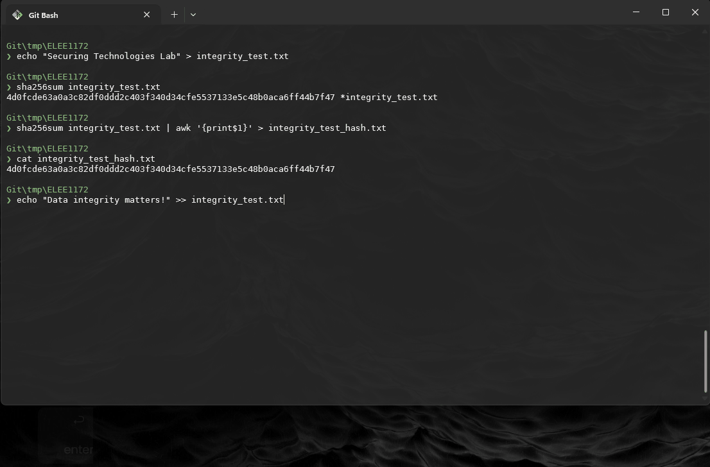
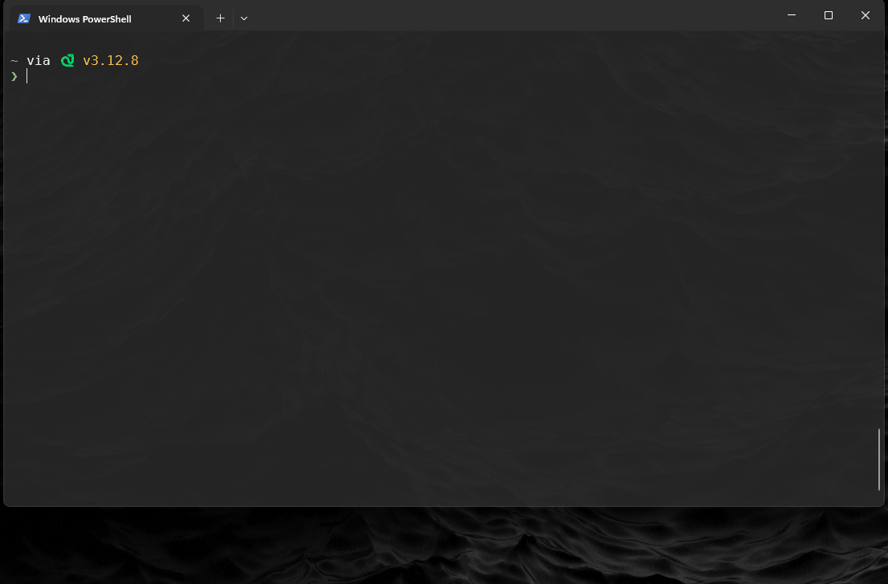
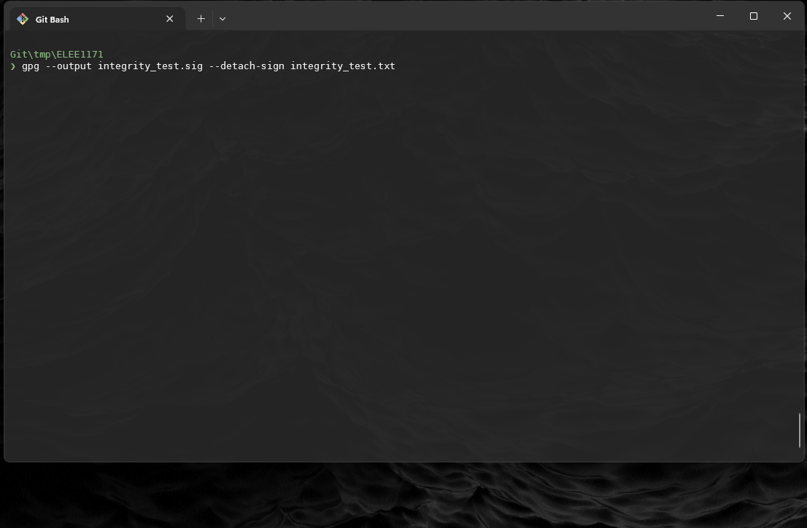

# Integrity - Understanding Hashing and Security 

## Overview 

In this lab, you will explore the concept of hashing and its crucial role in data security. You will engage in both discussions  and practical hands-on exercises to gain a deeper understanding of hashing algorithms and their applications. By the end of this lab, you should be able to explain what hashing is, understand its importance in security, and execute basic hashing to verify file integrity.

~~~admonish important

If you see a `$` in the a terminal alert box, then the line is a command, do not type `$`

~~~

## 1. Using Hashing for Integrity Verification


### 1.1 Bash (Linux/macOS)

1. Create a test file:

    ~~~admonish terminal 

    ```sh
    $ echo "Securing Technologies Lab" > integrity_test.txt
    ```

    ~~~

2. Compute the sha256 hash:

    ~~~admonish terminal

    ```sh
    $ sha256sum integrity_test.txt
    ```

    ~~~

    ~~~admonish output

    ```sh
    4d0fcde63a0a3c82df0ddd2c403f340d34cfe5537133e5c48b0aca6ff44b7f47 *integrity_test.txt
    ```

    ~~~


3. Record the hash value.

    ~~~admonish terminal

    ```sh
    $ sha256sum integrity_test.txt | awk '{print $1}' > integrity_test_hash.txt
    ```

    ~~~

4. Verify that only the hash in recorded in the file

    ~~~admonish terminal

    ```sh
    $ cat integrity_test_hash.txt
    ```
    
    ~~~
    
    ~~~admonish output
    
    ```
    4d0fcde63a0a3c82df0ddd2c403f340d34cfe5537133e5c48b0aca6ff44b7f4
    ```

    ~~~


    ~~~admonish tip

    

    ~~~


5. Modify the file:

    ~~~admonish terminal 

    ```sh
    $ echo "Data integrity matters!" >> integrity_test.txt
    ```

    ~~~

6. Recompute the hash and observe the change:

    ~~~admonish terminal 

    ```sh
    $ sha256sum integrity_test.txt
    ```

    ~~~

7. Record the hash value.

    ~~~admonish terminal

    ```sh
    $ sha256sum integrity_test.txt | awk '{print $1}' > integrity_test_hash_2.txt
    ```

    ~~~

8. Now we can compare the hashes

    ~~~admonish terminal

    ```
    $ diff integrity_test_hash.txt integrity_test_hash_2.txt
    ```
    
    ~~~
    
    ~~~admonish output
    
    ```
    1c1
    < 4d0fcde63a0a3c82df0ddd2c403f340d34cfe5537133e5c48b0aca6ff44b7f47
    ---
    > e61f0e879c89b42b8832dc93914e9e946bfe3b0b0abf652d707d8a4d33b919f0
    ```

    ~~~

    ~~~admonish tip

    

    ~~~

### 1.2 PowerShell (Windows)

9. Create a test file:

    ~~~admonish terminal 

    ```ps1
    $ Set-Content -Path integrity_test.txt -Value "Securing Technologies Lab"
    ```

    ~~~

10. Compute the SHA256 hash:

    ~~~admonish terminal 

    ```sh
    $ Get-FileHash integrity_test.txt -Algorithm SHA256
    ```

    ~~~

    ~~~admonish output

    ```ps1
    Algorithm       Hash                                                                   Path
    ---------       ----                                                                   ----
    SHA256          E052877AA48CB6A49FE83EF9798EA1AFF9332A2A33128189C479144E84CB7C52       path/to/file...
    ```
    
    ~~~


11. Record the hash value.

    ~~~admonish terminal

    ```ps1
    $ Get-FileHash -Algorithm SHA256 integrity_test.txt | Select-Object -ExpandProperty Hash | Out-File integrity_test_hash_1.txt
    ```

    ~~~

12. Modify the file:


    ~~~admonish terminal

    ```ps1
    $ Add-Content -Path integrity_test.txt -Value "Data integrity matters!"
    ```

    ~~~

13. Recompute the hash and observe the change:

    ~~~admonish terminal

    ```ps1
    $ Get-FileHash -Algorithm SHA256 integrity_test.txt | Select-Object -ExpandProperty Hash | Out-File integrity_test_hash_2.txt
    ```

    ~~~

14. Compare

    ~~~admonish terminal

    ```ps1
    $ Compare-Object (Get-Content integrity_test_hash_1.txt) (Get-Content integrity_test_hash_2.txt)

    ```
    
    ~~~
    
    ~~~admonish output
    
    ```
    InputObject                                                      SideIndicator
    -----------                                                      -------------
    4A2422E450E9A4A0F367B097F1573BB8596EA0CBC685AB89FAB39EA8C72FE9DC =>
    E052877AA48CB6A49FE83EF9798EA1AFF9332A2A33128189C479144E84CB7C52 <=
    ```

    ~~~

15. Notice that in both environments, Powershell and Bash, give same hash outputs:

    ~~~admonish output title="Bash"

    ```
    $ diff integrity_test_hash.txt integrity_test_hash_2.txt
    1c1
    < 4d0fcde63a0a3c82df0ddd2c403f340d34cfe5537133e5c48b0aca6ff44b7f47
    ---
    > e61f0e879c89b42b8832dc93914e9e946bfe3b0b0abf652d707d8a4d33b919f0
    ```

    ~~~

    ~~~admonish output title="Powershell"

    ```
    $ Compare-Object (Get-Content integrity_test_hash_1.txt) (Get-Content integrity_test_hash_2.txt)

    InputObject                                                      SideIndicator
    -----------                                                      -------------
    4A2422E450E9A4A0F367B097F1573BB8596EA0CBC685AB89FAB39EA8C72FE9DC =>
    E052877AA48CB6A49FE83EF9798EA1AFF9332A2A33128189C479144E84CB7C52 <=
    ```

    ~~~

    ~~~admonish tip

    

    ~~~


## 2. Using Digital Signatures for Integrity

~~~admonish warning

The `gpg` command might not be available in the Windows Powershell shell.

The Following steps will be conducted in the bash terminal

~~~

~~~admonish example title="What is a GPG Key?"

- A GPG (GNU Privacy Guard) key is a cryptographic key used for encryption, decryption, signing, and verifying data. It consists of:

- A public key, which can be shared with others to verify signatures or encrypt messages for the owner.

- A private key, which is kept secret and used for signing files or decrypting messages.

In a later exercise, will explore public and private keys. For now we only need to know how to use the tool.

~~~

16. Generate a GPG key (if not already created):

    ~~~admonish terminal

    ```sh
    $ gpg --full-generate-key
    ```

    Follow the on screen instructions: 

    - Choose key type: RSA

    - Set key size (2048 or 4096 recommended for security)

    - Enter a validity period

    - Provide a name and email

    - Set a passphrase for the key (eg 123456789)

    ~~~

    ~~~admonish tip

    
    
    ~~~

17. Use gpg to generate a signature:

    ~~~admonish terminal

    ```sh
    $ gpg --output integrity_test.sig --detach-sign integrity_test.txt
    ```

    ~~~
    
    ~~~admonish example title="`--sign file` vs `--detach-sign`?"

    - `--sign file`: Creates a combined signed file (message + signature).

    - `--detach-sign` file: Creates a separate signature (`.sig` file), leaving the original file unchanged.

    ~~~

    ~~~admonish tip

    

    ~~~


18. Check that the `integrity_test.sig` exists

    ~~~admonish terminal

    ```
    $ ls
    ```

    ~~~

    ~~~admonish output
    
    ```
    integrity_test.sig  integrity_test.txt  integrity_test_hash_2.txt
    ```
    
    ~~~

19. Run the following command to determine the `integrity_test.sig`:

    ~~~admonish terminal

    ```
    $ file --mime-type integrity_test.sig
    ```
    ~~~
    
    ~~~admonish output
    
    ```
    integrity_test.sig: application/octet-stream
    ```

    ~~~

20. Because it is an octect-stream we know that file is hex or binary file, so we can view some conent using `xxd`:

    ~~~admonish terminal

    ```
    $ xxd integrity_test.sig
    00000000: 8901 b304 0001 0800 1d16 2104 ba89 8914  ..........!.....
    00000010: ac7f 3fa8 dbdb a378 8027 cea6 a118 b8f0  ..?....x.'......
    00000020: 0502 67d1 e81f 000a 0910 8027 cea6 a118  ..g........'....
    00000030: b8f0 b665 0bff 6df4 8853 c4f6 39cd a4c6  ...e..m..S..9...
    00000040: b504 0dff eeef d11f 4008 ffc1 813c 2c21  ........@....<,!
    00000050: de95 3bf8 0605 5db2 f25b 0e03 4f6d 5e7a  ..;...]..[..Om^z
    00000060: 804c 31cd 4a93 6928 54e5 f293 6cfa 58a7  .L1.J.i(T...l.X.
    00000070: fb92 25f4 9c95 6644 84bd 8f8d cafc 8562  ..%...fD.......b
    00000080: 8534 1743 06a3 e6be c40c 7010 aaf5 cc70  .4.C......p....p
    00000090: 427c 8f25 99c0 7430 211a 5504 b075 ef88  B|.%..t0!.U..u..
    000000a0: c3ec fe54 29d3 9655 d315 eaf9 f75b 9c56  ...T)..U.....[.V
    000000b0: fa81 91fe 249b eca8 4da2 1925 5625 b7e1  ....$...M..%V%..
    000000c0: f04f 6c0d d10e 5c22 8f5b cbc4 17ac 1ccf  .Ol...\".[......
    000000d0: d0e1 ee44 9e67 3275 7cf8 b62c c919 f608  ...D.g2u|..,....
    000000e0: c2da cf0e c3a5 2b3c ffd5 a2f3 592a d0ec  ......+<....Y*..
    000000f0: 4e2f cb7a 9820 ec53 e094 e9a1 0ddc 871b  N/.z. .S........
    00000100: e841 81f5 c39c 4de7 d5bc b35b acbf 7a1b  .A....M....[..z.
    00000110: 524d a90c ec93 5ead 64a9 d51d bb56 80fb  RM....^.d....V..
    00000120: e51d b302 55be 5c68 4e16 52ca c045 650a  ....U.\hN.R..Ee.
    00000130: 17dd db8c 9b3a 141d 7b7f 70f0 ac73 3b58  .....:..{.p..s;X
    00000140: fe3a 7833 8cf4 ac45 9e55 6421 ec91 8b9c  .:x3...E.Ud!....
    00000150: 87be 84f9 b9a9 13cf 434d 9277 e01c 3422  ........CM.w..4"
    00000160: 7373 bd05 f7d6 0fe7 26ae 9de3 9a44 b2ab  ss......&....D..
    00000170: 069d 6a65 ac35 5ae1 2f6a a4ad 11a2 510f  ..je.5Z./j....Q.
    00000180: 2334 87f2 925b e0a6 d2e5 ed3c 2069 d55e  #4...[.....< i.^
    00000190: ce3c 9fe9 8955 69d8 9b2a da62 0eb4 e15e  .<...Ui..*.b...^
    000001a0: 6136 1fde 9ff6 7365 e35c b971 f103 0892  a6....se.\.q....
    000001b0: 7db9 87fa c881                           }.....
    ```

    ~~~

    ~~~admonish example title="What is a `.sig` file?"

    A `.sig` file is a detached digital signature generated by GPG. It is used to verify the authenticity and integrity of a file without modifying the original file. The `.sig` file contains:

    - A cryptographic **hash of the signed file**

    - The **digital signature of the file** created using the signer's private key

    Using a `.sig` file ensures that any modifications to the original file can be detected when verified against the signature.

    ~~~

21. Now verify the `integrity_test.txt` with the `intergity_test.sig`:

    ~~~admonish terminal
    
    ```
    $ gpg --verify integrity_test.sig integrity_test.txt
    ```

    ~~~

    ~~~admonish output

    ```
    gpg: Signature made Wed, Mar 12, 2025  8:01:35 PM GMTST
    gpg:                using RSA key BA898914AC7F3FA8DBDBA3788027CEA6A118B8F0
    gpg: checking the trustdb
    gpg: marginals needed: 3  completes needed: 1  trust model: pgp
    gpg: depth: 0  valid:   1  signed:   0  trust: 0-, 0q, 0n, 0m, 0f, 1u
    gpg: Good signature from "YourName (for lab on gpg integrity) <YourUsername@gre.ac.uk>" [ultimate]
    ```

    ~~~

22. If you run the command again, you should get a simplified output:

    ~~~admonish output

    ```
    gpg: Signature made Wed, Mar 12, 2025  8:01:35 PM GMTST
    gpg:                using RSA key BA898914AC7F3FA8DBDBA3788027CEA6A118B8F0
    gpg: Good signature from "YourName (for lab on gpg integrity) <YourUsername@gre.ac.uk>" [ultimate]
    ```
    ~~~

23. Modify the `integrity_file.txt` and rerun the `gpg` command.

    ~~~admonish terminal

    ```
    $ echo "Another line" >> integrity_test.txt
    $ gpg --verify integrity_test.sig integrity_test.txt
    ```

    ~~~

24. GPG checks the file by running the key over it again to see if the same output is produced, it not then the integrity of the file is compromised.

    ~~~admonish output

    ```
    gpg: Signature made Wed, Mar 12, 2025  8:01:35 PM GMTST
    gpg:                using RSA key BA898914AC7F3FA8DBDBA3788027CEA6A118B8F0
    gpg: BAD signature from "YourName (for lab on gpg integrity) <YourUsername@gre.ac.uk>" [ultimate]
    ```

    ~~~
