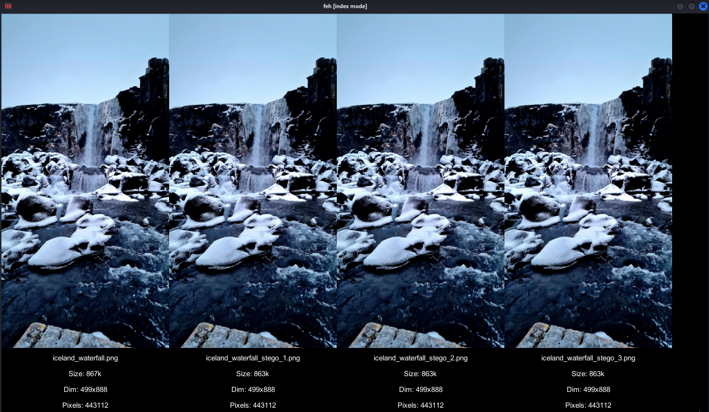

# Steganography

~~~admonish info

By the end of this lab you should be able to:

- Explain the difference between encryption and steganography

- Encode and decode messages using LSB image steganography

- Detect steganography using forensic tools

- Understand and apply text-based stego techniques

- Reflect on steganography as a tool for privacy, security, and deception

~~~

## Part 1: LSB Steganography with Images

~~~admonish info

Tools: Python (`encode.py`, `decode.py`), PNG files

- Task 1.1: Encode a message in a PNG using `encode.py`

- Task 1.2: Decode it with `decode.py`

- Task 1.3: Change bit plane to b3 — observe impact on image fidelity

- Task 1.4: Use zsteg to detect hidden content (show it fails above b4)

- Reflection

~~~

### Task 1.1: Encode a message in a PNG using `encode.py`

1. Firstly, create a script in a new folder called `stego/encode.py`

    ~~~admonish terminal

    ```sh
    $ mkdir stego && touch stego/encode.py
    ```
    ~~~

2. Open the `stego/encode.py` in your text editor of choice (I am using `vim`):

    ~~~admonish terminal

    ```
    $ cd stego/ 
    $ vim encode.py
    ```
    ~~~

3. Reproduce the following code: 

    ~~~admonish code title="encode.py, 53 lines" collapsible=true

    ```py
    from PIL import Image
    import sys

    def encode(image_path, output_path, message, bit_plane):
        if bit_plane < 1 or bit_plane > 7:
            raise ValueError("Bit plane must be between 1 and 7")

        img = Image.open(image_path)
        img = img.convert('RGBA')
        binary_msg = ''.join(f"{ord(c):08b}" for c in message) + '00000000'  # NULL terminator

        pixels = list(img.getdata())
        encoded_pixels = []

        bit_idx = 0
        mask = 1 << (bit_plane - 1)
        inverse_mask = 255 - mask

        for r, g, b, ain pixels:
            if bit_idx < len(binary_msg):
                r = (r & inverse_mask) | (int(binary_msg[bit_idx]) << (bit_plane - 1))
                bit_idx += 1
            if bit_idx < len(binary_msg):           
                g = (g & inverse_mask) | (int(binary_msg[bit_idx]) << (bit_plane - 1))
                bit_idx += 1
            if bit_idx < len(binary_msg):
                b = (b & inverse_mask) | (int(binary_msg[bit_idx]) << (bit_plane - 1))
                bit_idx += 1
            encoded_pixels.append((r, g, b, sca))

        img.putdata(encoded_pixels)
        img.save(output_path)
        print(f"Message encoded and saved to: {output_path}")

    if __name__ == "__main__":
        if len(sys.argv) != 5:
            print("Usage: encode.py <input_image> <output_image> <message> <bit_plane>")
            sys.exit(1)

        input_path = sys.argv[1]
        output_path = sys.argv[2]
        message = sys.argv[3]
        try:
            bit_plane = int(sys.argv[4])
        except ValueError:
            print("Bit plane must be an integer between 1 and 7")
            sys.exit(1)

        try:
            encode(input_path, output_path, message, bit_plane)
        except Exception as e:
            print(f"Error: {e}")
            sys.exit(1)
    ```
    ~~~

    ~~~admonish example title="Explanation" collapsible=true

    **Convert the Message to Binary**

    ```py
    binary_msg = ''.join(f"{ord(c):08b}" for c in message) + '00000000'
    ```
    
    - `ord(c)` converts each character (e.g., 'A') to its ASCII value (65)

    - `f"{...:08b}"` formats it as 8-bit binary (`'01000001'`)

    - `'00000000'` is a null terminator, signalling the end of the message

        - "This" → `01010100 01101000 01101001 01110011` + `00000000`

    **Bit Mask Setup**
    
    ```py
    mask = 1 << (bit_plane - 1)
    inverse_mask = 255 - mask
    ```
    - These control which bit of the byte we modify:
        - `1 << (bit_plane - 1)` shifts 1 left to target the desired bit.
        
        <br>
        
        | Bit Plane | Binary   | Decimal |
        | --------- | -------- | ------- |
        | 1 (LSB)   | 00000001 | 1       |
        | 2         | 00000010 | 2       |
        | 3         | 00000100 | 4       |
        | ...       | ...      | ...     |

    - `mask = 0b00000100` (for bit plane 3)
    - `inverse_mask = 0b11111011` — used to clear the target bit

    **Iterate Through Pixels and Modify Bits**

    ```py
    for r, g, b in pixels:
    if bit_idx < len(binary_msg):
        r = (r & inverse_mask) | (int(binary_msg[bit_idx]) << (bit_plane - 1))
    ```
    - Let’s break this math down:

        - `r & inverse_mask`: clears the target bit

            e.g., `r = 10110110`, `mask = 11111011` → `10110010`

        - `(int(binary_msg[bit_idx]) << (bit_plane - 1))`:

            - Converts the current binary digit (`0` or `1`) into the correct bit position

            - If `bit_plane = 3` and bit = `1`, you shift: `1 << 2 = 0b00000100`

        - `|` (bitwise OR) inserts the bit
            - This replaces just 1 bit in the color channel, leaving the rest untouched.

        - The same logic is applied to G and B if more bits remain.
    
    **Update the Image and Save**
    
    ```py
    img.putdata(encoded_pixels)
    img.save(output_path)
    ```
    
    - This writes your modified pixel data back and saves the output image.

    **Visual Summary (Example for R = 182, bit_plane = 3, bit = 1)**
    
    | Step               | Binary     | Decimal |
    | ------------------ | ---------- | ------- |
    | Original R         | `10110110` | 182     |
    | Clear bit 3        | `10110010` | 178     |
    | Bit to embed (`1`) | `00000100` | 4       |
    | New R              | `10110110` | 182     |

    If bit = `0`:

    | Clear + 0 → `10110010` | = 178 (b3 cleared)

    ~~~

4. Copy ,`cp`, the watefall_image from `/opt/gre/steganography_lab/waterfall_image.png` to the current directory and then run the program supplying the file name and other arguments as shown here:

    ~~~admonish terminal
    
    ```sh
    $ cp /opt/gre/steganography_lab/waterfall_image.png .
    $ python3 encode.py waterfall_image.png waterfall_image_stego_1.png "TEST" 1
    $ python3 encode.py waterfall_image.png waterfall_image_stego_2.png "TEST" 2
    $ python3 encode.py waterfall_image.png waterfall_image_stego_3.png "TEST" 3
    ```

    ~~~

5. Open images side by side using 

    ~~~admonish terminal
    
    ```sh
    $ feh -i -X -W 1476 -y 350 -E 700 iceland_waterfall*
    ```

    ~~~

    ~~~admonish output

    
    
    Notice how even though we modified the LSB the original file has decreased by 100k.

    ~~~

6. Now use `pngcheck` to check the integrity of the `*.png`

    ~~~admonish terminal
    
    ```sh
    $ pngcheck -ts iceland_waterfall*
    ```
    ~~~

    ~~~admonish output collapsible=true

    ```sh
    OK: iceland_waterfall.png         (499x888, 32-bit RGB+alpha, non-interlaced, 51.1%).
    OK: iceland_waterfall_stego_1.png (499x888, 32-bit RGB+alpha, non-interlaced, 51.3%).
    OK: iceland_waterfall_stego_2.png (499x888, 32-bit RGB+alpha, non-interlaced, 51.3%).
    OK: iceland_waterfall_stego_3.png (499x888, 32-bit RGB+alpha, non-interlaced, 51.3%).

    No errors were detected in 4 of the 4 files tested.
    ```
    
    The images are structurally valid and pass PNG validation — which demonstrates how well steganography can hide in plain sight, even when tools like `pngcheck` say 'OK'

    Though we know that because we have the original to compare against, do use the change in non-interlaced by 0.2%. 

    ~~~

7.

### Task 1.2: Decode it with `decode.py`

### Task 1.3: Change bit plane to b3 — observe impact on image fidelity

### Task 1.4: Use zsteg to detect hidden content (show it fails above b4)

### Reflection

How does bit plane depth affect detectability and capacity?

-----

## Part 2: Steganalysis Tools

~~~admonish info

Tools: `zsteg`, `binwalk`, `exiftool`, `stegsolve`

- Task 2.1: Analyze a stego image with `zsteg` and extract message

- Task 2.2: Use `exiftool` to check metadata for signs of manipulation

- Task 2.3: Use `binwalk` to find polyglot or appended files

- Task 2.4: Open image in `stegsolve` and visually inspect bit planes

~~~

### Task 2.1: Analyze a stego image with `zsteg` and extract message

### Task 2.2: Use `exiftool` to check metadata for signs of manipulation

### Task 2.3: Use `binwalk` to find polyglot or appended files

### Task 2.4: Open image in `stegsolve` and visually inspect bit planes

------

## Part 3: Text-Based Steganography

~~~admonish info

Tools: `snow`, `zwsp-steganography`, `cat -A`, `hexdump`

- Task 3.1: Use `snow` to hide a message in a `.txt` file via whitespace

- Task 3.2: Extract and decode the message

- Task 3.3: Try zero-width Unicode stego (`U+200B`, etc.)

- Task 3.4: Inspect files with `od -c` or `cat -v` to reveal anomalies

- Challenge

~~~

### Task 3.1: Use `snow` to hide a message in a `.txt` file via whitespace

### Task 3.2: Extract and decode the message

### Task 3.3: Try zero-width Unicode stego (`U+200B`, etc.)

### Task 3.4: Inspect files with `od -c` or `cat -v` to reveal anomalies

### Challenge

