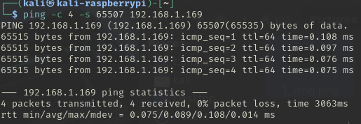
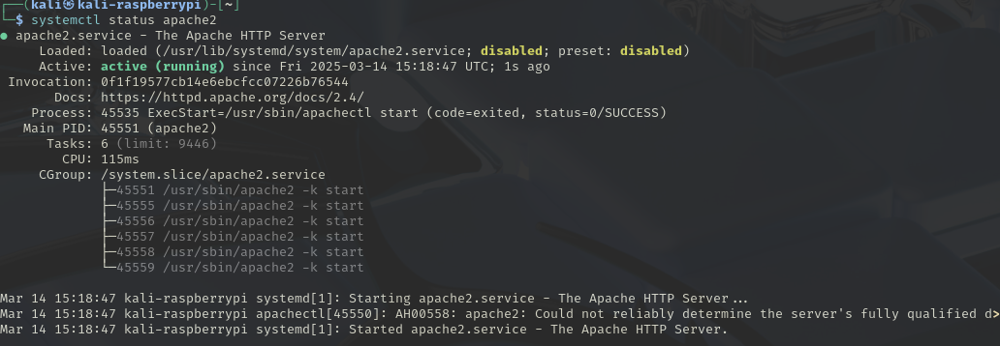
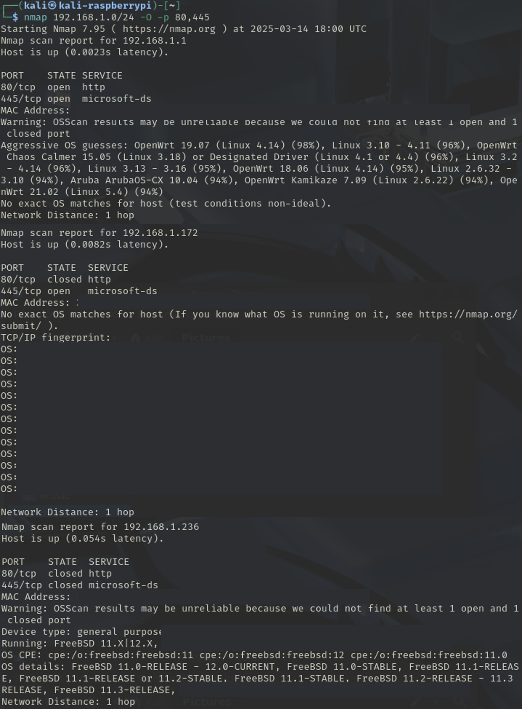
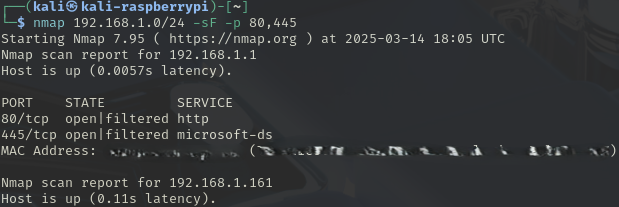

# Threats and Threat Actors | System Hardening 


~~~admonish important

There will be a quick demo on Linux terminal basics to acquaint those who are not familiar with the OS before the commencement of this lab. 

We will be using Kali linux image with on a Raspberry Pi 5 for the session only, this will be returned per session

~~~

~~~admonish warning

Performing any of the attacks outside of this educational setting, outside of the network, `ELEE1171_Network`, the Raspberry Pis are connected to, is breaking the law. 

~~~

## Exercise 1

**Basic ping command:**

1. Ping the IP address `192.168.1.169`

    ~~~admonish terminal

    ```
    ping -c4 192.168.1.169 
    ```

    ~~~

    - Take note of the default packet size 

    ~~~admonish output collapsible=true

    <div align=center>

    

    </div>

    ~~~

2. Increase the packet size to [1024, 4098] and set the count to 4:


    ~~~admonish output collapsible=true
 
    <div align=center>
   
    

    </div>

    ~~~


3. Try and go larger, use 65536 (\\(2^{16}\\)), did it succeed?

    ~~~admonish output collapsible=true

    <div align=center>

    

    </div>

    ~~~


4. Try again using the maximum as suggested:

    ~~~admonish output collapsible=true

    <div align=center>

    

    </div>

    ~~~

5. {{#quiz ./quiz_1.toml}}


    ~~~admonish warning

    Hitting the target with heavier packets from multiple machines against a weak or already loaded server, it may crash. 

    Doing this on a computing device to another computing device you do not own on a network you do not own is technically against the law.

    ~~~


## Exercise 2

~~~admonish important

Divide yourselves into groups of 3 for Exercise 2. 

**Delegate:**

- 1 person to be the user 

- 1 person to be the web admin 

- 1 person to be the attacker 

**Roles:** 

- Web admin starts web service on their server 

- User tries to access the website from their computer 

- Attacker tries to take down the website by intentionally overloading the server with packets it cannot handle.

~~~


### 2.1 Web Admins

On your device you need to start your `apache2` server.

1.  First check to see if it exists 

    ~~~admonish terminal

    ```sh
    command -v apache2
    ```

    ~~~

    ~~~admonish output

    ```
    /usr/sbin/apache2
    ```

    ~~~

2. Then check the status of the service

    ~~~admonish terminal

    ```
    systemctl status apache2
    ```

    ~~~

    ~~~admonish output

    <div align=center>

    

    </div>

    ~~~

3. Start the service, you will need to enter your root password. 

    ~~~admonish terminal

    ```
      systemctl start apache2  
    ```

    ~~~

    ~~~admonish output

    <div align=center>

    

    </div>

    ~~~

4.  Check the IP addrees of your service, i.e your devices IP on `wlan0`

    ~~~admonish terminal

    ```
    ifconfig | grep wlan0 -A7
    ```

    ~~~

    ~~~admonish output

    Sample output, you need to find the `inet 192.168.1.[###]`
    ```
    wlan0: ....
             inet 192.168.1.[###]  netmask...
             ...
    ```

    ~~~

    

5. `apache2` will launch a webpage located in `/var/www/html/index.html`


### 2.2 Users

1. Open a browser 

2. Enter the IP Address of the web server in the URL field and hit ENTER 


    ~~~admonish output

    <div align=center>

    

    </div>

    ~~~

3. Refresh twice and take note of the loading speed/refresh rate, you can also bring up network status of the page in the url using <kbd>F12</kbd>


    ~~~admonish output

    <div align=center>


    

    ~~~

4. Wait for the attacker to launch the first attack, then refresh and take note of the loading speed/refresh rate.

    ~~~admonish output

    <div align=center>


    

    ~~~


5. Reload the page when the attacker halts the first attack. Repeat the same process for the second attack.

### 2.3 Attackers

1. `hping3` can be used for launching mild DoS attacks. 

    Regular SYN Flood attack against a web server. 
    
    Make the source random i.e., attackers aim to be as untraceable as possible. 

    The attack here is from a single source (DoS)

    ~~~admonish terminal

    ```
    hping3 --flood --rand-source [target IP]
    ```

    ~~~

    Note your observation on the server

    ~~~admonish output collapsible=true

    ~~~
    

2. Smurf attack, will broadcast to all machines on the subnet

    ~~~admonish warning

    Get permission from the lab instructor before performing this as it may affect all machines on the LAN

    ~~~

    ~~~admonish terminal

    ```
    hping3 --flood -a [target IP] 
    ```

    ~~~

3. You can check more `hping3` options/tags using:

    ~~~admonish terminal

    ```
    hping3 –help
    ```
    ~~~

### 2.4 Questions

{{#quiz ./quiz_1.toml}}

{{#quiz ./quiz_2.toml}}

{{#quiz ./quiz_3.toml}}


## Exercise 3


Discovering System Vulnerabilities and Hardening Systems 

[Target IP: Provided in the lab] 

[Target NW: Provided in the lab]

1. Using `Nmap` [network scanning tool] 

    ~~~admonish terminal
    
    ```
    nmap -sn  192.168.0.0/24 
    ```

    Replace the IP addresses here with the appropriate IP address/Network address of your target. 

    Perform a Ping Scan (Ping Sweep or Network Scan or Discovery Scan) 

    this will scan the entire network for live hosts 

    ~~~

    ~~~admonish output collapsible=true

    <div align=center>

    

    </div>

    ~~~

2. A basic scan instead:

    ~~~admonish terminal

    ```
    #nmap 192.168.0.64 
    ```

    ~~~

    ~~~admonish output collapsible=true

    <div align=center>

    

    </div>

    ~~~

3. Try a Version Scan 

    Now that you have ports that are open from the port scan, from the basic host scan, scan for version of services running on those ports 

    ~~~admonish terminal
    
    ```
    nmap 192.168.0.64 -sV -p 80  
    ```

    ~~~

    ~~~admonish output collapsible=true

    <div align=center>

    

    </div>

    ~~~

4. Perform an Operating System Scan (Protocol Scan) 

    ~~~admonish terminal
        
    ```
    nmap 192.168.0.64 -O -p 80,445 
    ```

    ~~~

    ~~~admonish output collapsible=true

    <div align=center>

    

    </div>

    ~~~

## Exercise 4

~~~admonish tip

You can do this part if you wish to have more fun. The concepts in this section would be discussed in the Network Security Class.

Targets to be used: 

1. Lab target machines on the lab network

~~~

You are to manipulate flags to get different results from a victim machine 

1. SYN Scan, Stealth Scan (Half-Open scan) 

    ~~~admonish terminal
        
    ```
    nmap -sS -p80,445 192.168.0.64  
    ```

    ~~~

    ~~~admonish output collapsible=true

    <div align=center>

    

    </div>

    ~~~

2. FIN Scan, Stealth Scan (Finish Scan) 

    On an Open Port Windows cannot understand this scan and therefore responds differently and with lots of flags, in 
    comparison to Linux that does not respond.

    ~~~admonish terminal
        
    ```
    nmap 192.168.0.64 -sF -p80,445
    ```

    ~~~

    ~~~admonish output collapsible=true

    <div align=center>

    

    </div>

    ~~~

3. ACK Scan, Stealth Scan (Acknowledge Scan)

    This scan is not usually used for port scanning but rather to discover if the firewall is on (filtered) or off (unfiltered).

    ~~~admonish terminal
        
    ```
    nmap 192.168.0.64 -sA -p80,445
    ```

    ~~~

    ~~~admonish output collapsible=true

    <div align=center>

    

    </div>

    ~~~

4. XMas, Stealth Scan (XMas Scan)

    ~~~admonish terminal
        
    ```
    nmap 192.168.0.64 -sX -p80,445 
    ```

    ~~~

    ~~~admonish output collapsible=true

    <div align=center>

    

    </div>

    ~~~